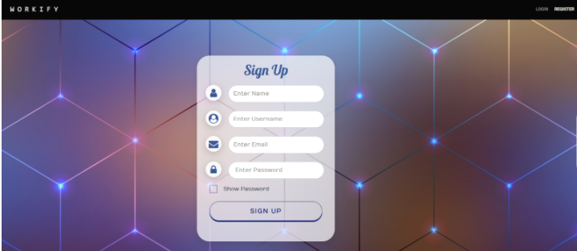

<div align="center">

[](https://nodejs.org/en/)
[](https://reactjs.org/docs/getting-started.html)
[](mongodb.com "MongoDB")
[](https://code.visualstudio.com/ "Visual Studio Code")

</div>
<p align="center">
  <a href="" rel="noopener">
 </a>
 
</p>
<h1 align = 'center'><b>Workify</b></h1>

## Description

Workify provides a platform for users to create project groups, add their team members and assign work to the team members of the project. It also keeps track of these tasks whether they're completed or not before the due date provided.We have a notification feature which notifies users on project creation and also when work is assigned to a team member via mail. It helps users to manage and do their project submissions on time with a user friendly interface.

<p>
For more details-
<a href="https://drive.google.com/file/d/1KN6IyozeilZbBgpKIkVjl86dv8VRoI6-/view?usp=sharing">
Click here 
</a>
</p>

---

## Features

<b>User</b>

- Sign In and Sign Up
- Create, edit, view and delete project
- Manage members of project
- Email notifier
- View work/details of project
- Manage work for specific project
- Work summary page to view tasks of all projects together

---

## Demo

Workify application
<br>Sign in:

  <a href="" rel="noopener">
 </a>
 <br>


---

## How To Use

#### Software Requirements

VSCode

## Installation

Install the dependencies by running:
On command prompt go to the directory 'Workify/WorkifyProject'

```html
npm i
```

```html
node app.js
```

Then go to the directory 'Workify/WorkifyProject/angular-src'

```html
npm i
```

```html
ng serve
```

---

### Tech stack

`MongoDB` − Database System<br>
`Express` − Back-end Web Framework<br>
`Node.js` − Web Server Platform<br>
`AngularJS` − Front-end Framework<br>

<h3 align="center"><b>Developed  by <a href="https://github.com/urvinb">Urvi Bheda</a>,<a href="https://github.com/Sakshi107"> Sakshi Shelar</a> and <a href="https://github.com/hiral72"> Hiral Sheth</a></b></h3>
